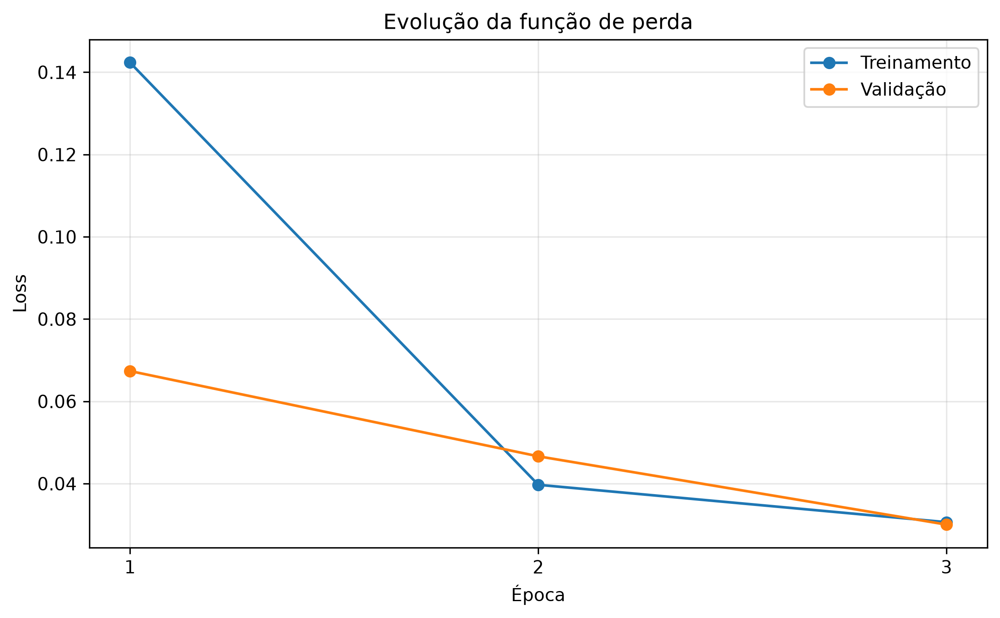
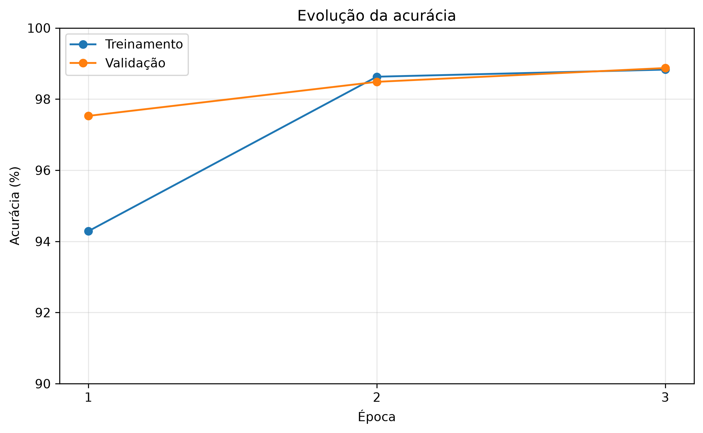
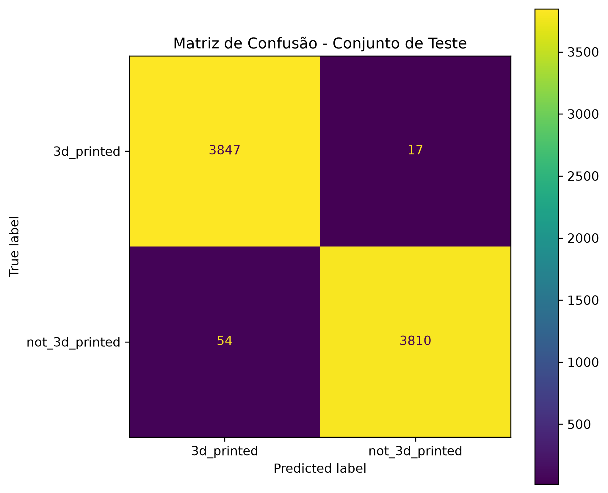
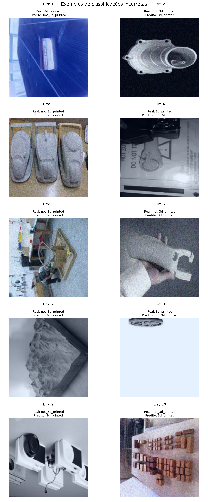

# Classificador de Objetos Impressos em 3D

## 1. Descrição do problema abordado

O projeto abordou a identificação de objetos produzidos por impressão 3D a partir de imagens, que é um problema de classificação de imagens e pode ser utilizado em diferentes contextos, como inspeção visual, organização de bases de imagens e sistemas automatizados de identificação de objetos.

Neste trabalho, o problema abordado consiste em desenvolver um modelo de aprendizado de máquina capaz de classificar imagens em duas categorias:

- `3d_printed`: imagens de objetos produzidos por impressão 3D;
- `not_3d_printed`: imagens de objetos que não foram produzidos por impressão 3D.

O desafio era realizar essa classificação utilizando as características visuais presentes nas imagens. Os objetos podem apresentar diferentes formatos, tamanhos, cores, posições, condições de iluminação e níveis de qualidade da imagem,tornando a tarefa de classificação não trivial.

Dessa forma, o objetivo do projeto é avaliar a capacidade de um modelo de visão computacional em aprender padrões visuais associados às duas classes e utilizá-los para realizar novas classificações de forma automatizada.

A partir desse problema, o trabalho busca responder à seguinte questão:

> **É possível utilizar um modelo de aprendizado profundo para identificar, a partir de uma imagem, se um objeto foi ou não produzido por impressão 3D?**

## 2. Descrição da base de dados

A base de dados utilizada no projeto foi a https://huggingface.co/datasets/cmudrc/3d-printed-or-not, e é composta por **51.520 imagens**, distribuídas igualmente entre duas classes: `3d_printed`, representando objetos produzidos por impressão 3D, e `not_3d_printed`, representando objetos que não foram produzidos por impressão 3D.

Cada classe possui **25.760 imagens**, resultando em uma base balanceada. As imagens apresentam diferentes objetos, formatos, condições de iluminação e características visuais.

A base foi dividida em três conjuntos:

- **Treinamento:** 36.064 imagens (70%);
- **Validação:** 7.728 imagens (15%);
- **Teste:** 7.728 imagens (15%).

A divisão foi realizada de forma estratificada, mantendo a proporção de 50% para cada classe nos três conjuntos.

## 3. Metodologia adotada

Foi adotada uma abordagem de aprendizado profundo para classificação de imagens, utilizando a arquitetura **ResNet18** como modelo de visão computacional.

Inicialmente, as imagens foram pré-processadas e redimensionadas para **224 × 224 pixels**, sendo convertidas para três canais de cor (RGB), garantindo um formato compatível com a arquitetura utilizada.

A base de dados foi dividida de forma estratificada em **70% para treinamento, 15% para validação e 15% para teste**, mantendo a distribuição equilibrada entre as duas classes.

Para o treinamento, foi utilizada a função de perda **Cross Entropy Loss** e o otimizador **Adam**, com taxa de aprendizado de `0,0001`. O modelo foi treinado durante **3 épocas**, utilizando lotes (*batches*) de 32 imagens.

Durante o treinamento, o desempenho foi acompanhado por meio das métricas de **loss** e **acurácia** nos conjuntos de treinamento e validação. Após o treinamento, o melhor modelo, definido com base na maior acurácia de validação, foi utilizado para avaliação no conjunto de teste.

E por fim, foram utilizadas a **acurácia, precisão, recall, F1-score e matriz de confusão** para avaliar o desempenho do classificador, além da análise visual de exemplos classificados incorretamente.

## 4. Relato dos experimentos realizados

Foram realizados experimentos de treinamento e avaliação do modelo utilizando a base de dados completa, sem redução do número de imagens e usando minha CPU com 6 threads como processamento.

Inicialmente, foi realizado um treinamento preliminar com **1 época** levando em média (32 min), com o objetivo de verificar o funcionamento do pipeline de dados, do modelo e do processo de treinamento. Nesse experimento, o modelo apresentou **98,03% de acurácia na validação** e **97,98% de acurácia no conjunto de teste**.

Após a validação do funcionamento da abordagem, foi realizado o treinamento definitivo utilizando **3 épocas** levando em média (1h 40min), mantendo *batch size* de 32 e taxa de aprendizado de `0,0001`. O modelo apresentou evolução ao longo das épocas, atingindo **98,87% de acurácia na validação** ao final do treinamento.

O melhor modelo obtido foi então utilizado para a avaliação final no conjunto de teste. Também foi realizada uma análise dos erros de classificação, sendo identificadas **71 classificações incorretas** entre as 7.728 imagens do conjunto de teste.

Além das métricas quantitativas, foram geradas visualizações da evolução da função de perda e da acurácia durante o treinamento, da matriz de confusão e de exemplos de imagens classificadas incorretamente.

## 5. Análise dos resultados e conclusões

O treinamento realizado durante três épocas apresentou evolução consistente no desempenho do modelo. A acurácia de treinamento aumentou de **94,29% na primeira época para 98,83% na terceira**, enquanto a acurácia de validação passou de **97,53% para 98,87%**. Ao mesmo tempo, a função de perda apresentou redução, indicando que o modelo conseguiu aprender progressivamente as características visuais associadas às duas classes.

### Evolução do treinamento

As figuras abaixo apresentam a evolução da função de perda e da acurácia durante as três épocas de treinamento.

### Avaliação no conjunto de teste

Após o treinamento, o melhor modelo foi avaliado no conjunto de teste, composto por **7.728 imagens que não foram utilizadas durante o treinamento**. O modelo obteve **99,08% de acurácia**, com uma perda de **0,0266**.

A matriz de confusão apresentou **3.847 acertos para a classe `3d_printed` e 3.810 acertos para a classe `not_3d_printed`**, totalizando apenas 71 classificações incorretas.

O relatório de classificação apresentou valores próximos de **0,99 para precisão, recall e F1-score em ambas as classes**, indicando um desempenho equilibrado entre os dois grupos.

### Análise dos erros

Apesar do elevado desempenho, foram identificadas **71 classificações incorretas** no conjunto de teste. Alguns exemplos desses erros foram analisados visualmente.

A análise indica que parte das classificações incorretas está relacionada a imagens com características visuais ambíguas, baixa qualidade, diferentes condições de captura ou objetos cuja aparência pode ser semelhante à da classe oposta. Isso demonstra que o modelo realiza a classificação com base nos padrões visuais presentes nas imagens e não possui informações sobre o processo real de fabricação dos objetos.

### Conclusão

Os resultados demonstram que a abordagem utilizando a arquitetura **ResNet18** foi capaz de realizar a classificação entre objetos impressos e não impressos em 3D com elevado desempenho. A acurácia de **99,08% no conjunto de teste** indica que o modelo apresentou boa capacidade de generalização para os dados avaliados.

Entretanto, os resultados devem ser interpretados considerando as características específicas da base utilizada. O modelo realiza uma classificação baseada exclusivamente em informações visuais e, portanto, não é capaz de confirmar fisicamente o processo de fabricação de um objeto. Além disso, seu desempenho pode ser diferente quando aplicado a imagens obtidas em condições distintas das presentes no conjunto de dados.

De maneira geral, o experimento atingiu o objetivo proposto de desenvolver um classificador automático capaz de distinguir, a partir de imagens, objetos pertencentes às classes `3d_printed` e `not_3d_printed`.

## Bônus — Teste com imagens reais

Como etapa complementar aos experimentos realizados com a base de dados utilizada no treinamento e avaliação do modelo, realizei alguns testes com imagens de objetos reais presentes em minha casa.

O objetivo foi verificar o comportamento desse modelo diante das imagens que não pertenciam à base utilizada durante o desenvolvimento, avaliando sua capacidade de generalização para diferentes objetos, ambientes, condições de iluminação e características visuais.

Foram selecionadas oito imagens de objetos distintos, sendo dois classificados previamente como objetos impressos em 3D e seis como objetos que não foram produzidos por impressão 3D.

### Resultados

| Objeto | Classe esperada | Classe prevista | Confiança | Resultado |
|---|---|---|---:|---|
| Boneco/Funko Pop | `3d_printed` | `3d_printed` | 98,38% | ✅ Acerto |
| Bola de beisebol | `not_3d_printed` | `not_3d_printed` | 95,81% | ✅ Acerto |
| Pikachu | `3d_printed` | `3d_printed` | 99,95% | ✅ Acerto |
| Prato decorativo | `not_3d_printed` | `not_3d_printed` | 99,99% | ✅ Acerto |
| Vaso de porcelana | `not_3d_printed` | `3d_printed` | 93,67% | ❌ Erro |
| Vaso decorativo de porcelana | `not_3d_printed` | `3d_printed` | 100,00% | ❌ Erro |
| Cadeira gamer | `not_3d_printed` | `3d_printed` | 99,99% | ❌ Erro |
| Livro | `not_3d_printed` | `not_3d_printed` | 91,41% | ✅ Acerto |

No total, o modelo apresentou **5 classificações corretas em 8 imagens**, correspondendo a uma acurácia de **62,5%** nesse conjunto experimental.

### Análise do experimento

Os resultados demonstram que o modelo foi capaz de classificar corretamente alguns objetos reais, como o boneco, o Pikachu, a bola de beisebol, o prato decorativo e o livro. Entretanto, foram observadas classificações incorretas para os dois vasos de porcelana e para a cadeira gamer.

Um aspecto relevante foi a elevada confiança apresentada pelo modelo mesmo nos casos em que a classificação estava incorreta. Os dois vasos foram classificados como `3d_printed` com confianças de 93,67% e 100,00%, enquanto a cadeira apresentou confiança de 99,99%.

Esse comportamento evidencia que a confiança fornecida pelo modelo não deve ser interpretada isoladamente como garantia de uma classificação correta. O modelo pode apresentar alta confiança quando encontra características visuais semelhantes àquelas aprendidas durante o treinamento, mesmo que o objeto pertença à classe oposta.

### Conclusão do experimento externo

O teste com imagens reais apresentou resultado de **62,5% de acurácia**, demonstrando que o modelo possui capacidade de realizar classificações em imagens externas, mas ainda apresenta limitações de generalização.

Os erros observados, principalmente nos objetos de porcelana e na cadeira gamer, indicam a necessidade de ampliar e diversificar a base de treinamento, incluindo objetos de diferentes materiais, formatos, texturas, tamanhos e condições de iluminação.

Dessa forma, o experimento complementar reforça a importância de avaliar modelos de aprendizado de máquina não apenas com dados provenientes da mesma distribuição utilizada durante seu desenvolvimento, mas também em exemplos externos e mais próximos de aplicações reais.

Thiago Nunes Rodrigues da Silva